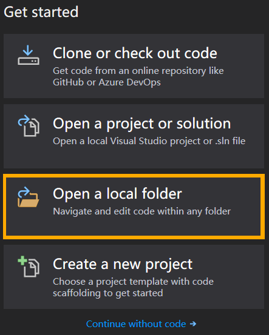
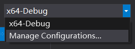
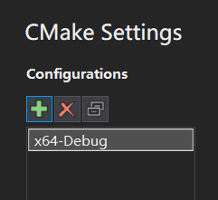
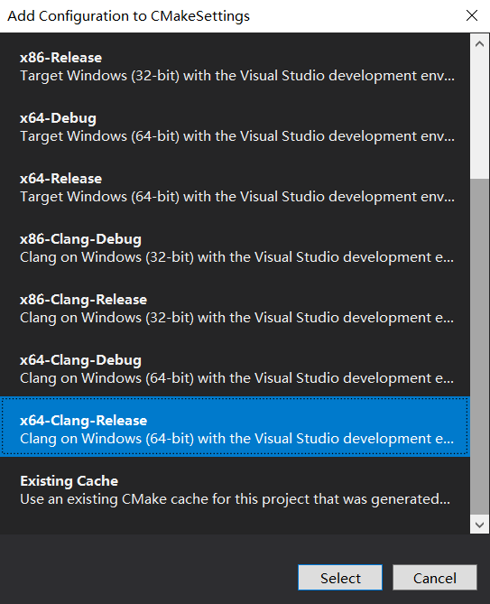
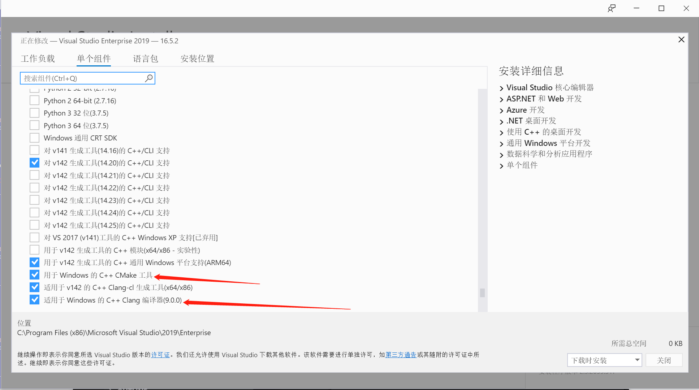
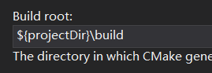
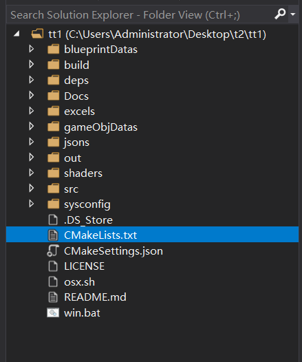
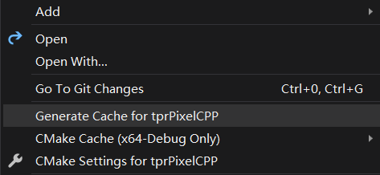

# 如何手动配置 Win10: Viual Studio，来生成 tprpix 项目的 cmake Cache

在原生项目中，我们准备了一个专用于 **Win10** 平台的文件：`CMakeSettings.json`。它被放置在根目录中。
每当使用 VS 打开 **tprpix** 项目时，这个文件就会被自动读取，进而自动帮助我们配置出正确的 cmake Cache。

**万一这个过程失败了，我们就需要通过手动配置的方式，来实现 cmake Cache 的生成。**

完整的过程如下：

启动 **Visual Studio 2019**，点选初始界面中的 `Open a local folder` 按钮，在弹出的窗口中，选择本程序的根目录 ->

进入主界面后，选择 **Manage Configurations...** 按钮 ->

在随之而来的 **CMake Settings** 面板中，移除掉已经存在的所有配置，然后手动创建一份新的配置：**x64-Clang-Release** ->

如果 **CMake Settings** 面板中没有 **x64-Clang-Release** 选项，请检查Visual Studio中是否安装了如下组件:

找到 **Build root** 一览，将其值修改为: `${projectDir}\build`（**注意**，这一步非常重要，请务必不要遗漏）

在左侧的 **Solution Explorer** 面板中，右键单击文件：`CMakeLists.txt`，在弹出的下拉菜单中选择：`Generate Cache for cppEmptyProject` ->

这将帮助我们生成 cmake Cache 数据。
等待片刻，直到下方 **Output** 面板中出现 `CMake generation finished.` 信息。
这表示 cmake Cache 生成成功。

现在，完整的 **cmake 配置** 工作已经完成。此后每一次打开本项目，VS 都能自动进入已经配置好的状态。

接下来我们可以退回 主 [README.md](../README.md)，继续学习如何 build 本项目。

