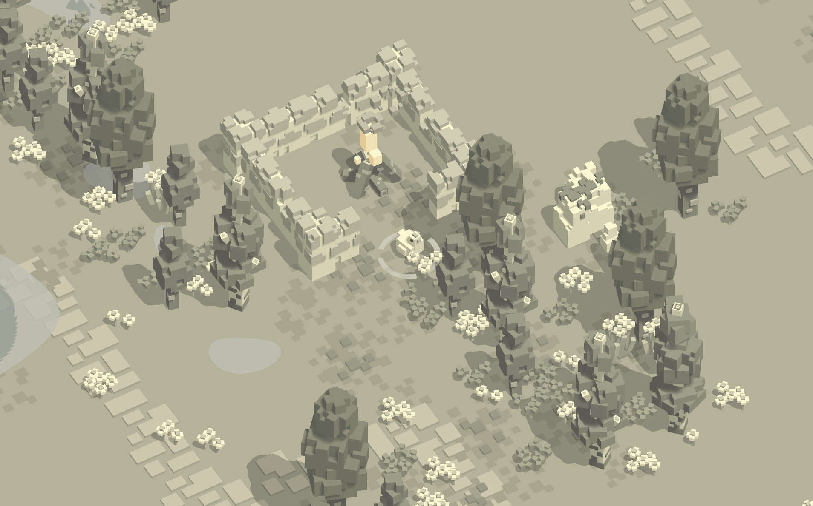
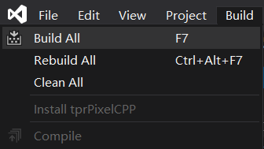
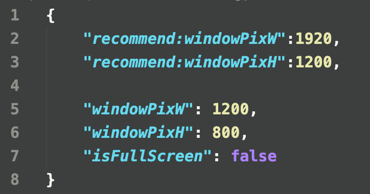

# tprPix
a Cross-Platform, 2D Survival Sandbox Game Project. 

Based on **C++17/OpenGL/SQLite3**.

- [中文版](README.ZH_CN.md)

(**tprPix** is the name of the Project, **NOT** the Game.)

## Which branch should I Download
Branch:**master** is OK.

## Which platform is supported
- **Win10**
- **MacOSX**(10.12 or later) 
- **Ubuntu**(16.04 or later) 

Maybe it can work in earlier versions, but I did not test Yet.

## Compiler compatibility
The recommended compiler is **Clang**, even if in **Win10**.

Make sure the compiler version support **C++17**.

## How to Install

### Mac OS X

The installation in **Mac** is very easy.

First,make sure you have installed:
- **CMake**(3.1 or later; 3.16 is recommended to support PCH and Unity builds)
- **Clang**(new enough to support **C++17** )
- **OpenGL** libs

Then,open your terminal, and "cd" to the app's root folder:

    $ cd .../appRootDir/

(**Notes**: the "appRootDir" here should be replaced by real root directory name)

after that, run a shell script:

    $ ./unix_release.sh

the shell script: `unix_release.sh`, will automatically install everything for you, which contains some folder replication work.
you can also choose `unix_debug.sh`, which will build a **DEBUG** app for you.

Now, All the Installation has **DONE**!!!

You can find **tprpix** file in **.../appRootDir/build/publish/** folder. 
(**Notes**: the "appRootDir" here should be replaced by real root directory name)

**Double Click** it and **Start your Game**!!!

### Ubuntu 
Similar to  **Mac OS X**.

First,make sure you have installed:

**CMake**(3.1 or later; 3.16 is recommended to support PCH and Unity builds)

    $ sudo apt-get install cmake

**Clang**(new enough to support **C++17** )

    $ sudo apt-get install llvm
    $ sudo apt-get install clang 

reset the default **C/C++ Compiler** by:

    $ sudo update-alternatives --config c++
    $ sudo update-alternatives --config cc

install some **Graphic Libs**:

    $ sudo apt-get install libx11-dev
    $ sudo apt-get install libglfw3-dev
    $ sudo apt-get install libsdl2-dev

Then,open your terminal, and "cd" to the app's root folder:

    $ cd .../appRootDir/

(**Notes**: the "appRootDir" here should be replaced by real root directory name)

after that, run a shell script:

    $ ./unix_release.sh

the shell script: `unix_release.sh`, will automatically install everything for you, which contains some folder replication work.
you can also choose `unix_debug.sh`, which will build a **DEBUG** app for you.

Now, All the Installation has **DONE**!!!

You can find **tprpix** file in **.../appRootDir/build/publish/** folder. 
(**Notes**: the "appRootDir" here should be replaced by real root directory name)

run the app in terminal:

    $ build/publish/tprpix

and **Start your Game**!!!

### Win10

To support **Clang** in **Win10**, We need to install **Visual Studio 2019** at first.

Once open **Visual Studio 2019**, click the button: `Open a local folder`, and choose the app's root folder ->

select **Manage Configurations...** ->

in **CMake Settings** panel, remove the existed configuration, and add a new one: **x64-Clang-Release** ->

if **x64-Clang-Release** was not in **CMake Settings** panel, please check whether CMake and Clang tools installed in Visual Studio ->

reset the **Build root** to `${projectDir}\build` (**Notes**: This **STEP** is very important!!! Please make sure the changes are **CORRECT**.)

back to **Solution Explorer** panel, right click the file: `CMakeLists.txt`, choose: `Generate Cache for tprPixelCPP`. ->

wait until the infomation: `CMake generation finished.` showed in **Output** panel.

After that, click `Build All` in `Build` Window.(or press `F7`) ->

Then, the build work will begin. A few minutes later，you will find a infomation: `Build All succeeded.` in **Output** panel. This means that the work in **Visual Studio 2019** is DONE!

Go back to the app's root folder, find and double click `win.bat` file. 
This script file will automatically copy some folders to `app/build/publish/`, 

Now, All the Installation has **DONE**!!!

You can find **tprpix.exe** file in **.../appRootDir/build/publish/ folder**. 
(**Notes**: the "appRootDir" here should be replaced by real root directory name)

**Double Click** it and **Start your Game**!!!

## the Ultimate_Publish_Folder

No matter which platform you compile on, the **Ultimate Publish Folder** is unique:
**.../appRootDir/build/publish/ folder**. 
you can copy this **publish** folder to any location which will not affect the executable of app.
All the resources needed for the app are integrated in the publish directory.

## How to Play
This game support both **Keyboard** and most mainstream **Joysticks**. 
Considering it's an action game, we recommend you to play with a **Joystick**(Xbox360-style).

### Joystick(Xbox360-Style):
- **LeftAxes** to move.

- **Button:A** to confirm. 
in game-world, you can push **Button:A** to Let the character speed up

- **Button:B** to let the character slow down in game-world.

- **Button:X/Y** to print some debug-infomation on terminal.

### Keyboard:
- **key:W/A/S/D** to move.
- **key:Enter** to confirm.
- **key:H/J/K/L** is mapped to **'A/B/X/Y'** in Joystick.

Once you enter the game-world, The only thing you can do is control a chicken(used for test), walk around and fly(By pressing the key: **'H'**(keyboard) or **'A'**(joystick) continuously)

Well,the remaining parts are still on developing.
So, please be  patient...

## How to change the app window size
Currently, FullScreen mode is not support yet. The Config file who control the window size is placed in file: **.../publish/jsons/windowConfig.json**. As show below:

If you want to change the **Window Size**, please modify the variables: `windowPixW, windowPixH` (base on pixel). As the variables `recommend:windowPixW, recommend:windowPixH` show, the recommended size is: 1920, 1200. (In fact, you can change `windowPixW, windowPixH` to any integer value, just not bigger than your monitor, and the program will automatically take care of the window aspect ratio.)

**PLEASE** do not **MODIFY** the variables: `recommend:windowPixW, recommend:windowPixH`. They are just some tips.

**PLEASE** do not **MODIFY** the variable: `isFullScreen`. Keep its value as `false`. Any change to this variable will case a crash in runtime.

After the modifying, save the file. run the app again, you will get new effect. **NO Need To Compile Again.**

# Existed Problems
Do not panic if you encounter the following problems:

## Fall into a crash when you create a new **Archive**
This bug has a small chance to be triggered.
When encountering this problem, it is recommended that you force to exit the program first. And **DELETE** the folder: **.../appRootDir/build/publish/dataBase/** directly. The app archive task is managed by this folder.Please feel free to delete it roughly.

## What can I do if three archives are full
Currently, the **UI System** is not finished yet.Even the archive system is incomplete.
If the archives is full, Please **DELETE** the folder: **.../appRootDir/build/publish/dataBase/** directly.

## What to do in case of flashback in operation
You can submit the command line information to issues. Or contact me through the following information, this will help me to complete the program better.

## More Bugs to be revealed
...

# License under the [BSD 3-Clause](LICENSE)

# Welcome feedback and suggestions
Since the project is still on developing,
more content will be launched later.

If you have any suggestions，please contact me.

## Contact
*   E-mail: [turesnake@gmail.com](mailto:turesnake@gmail.com)
*   E-mail: [turesnake@icloud.com](mailto:turesnake@icloud.com)
*   QQ: 651700603

